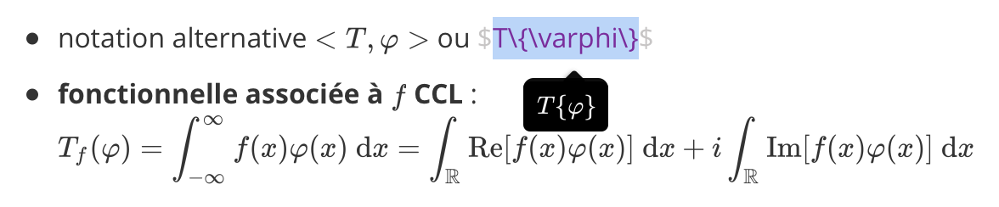

# EPFL

This repository contains summaries and cheatsheets of a 5 year-long curriculum at [EPFL](https://www.epfl.ch). It is mostly focused on computer science, communication systems, data science and computational neuroscience. This includes both undergraduate and graduate courses, sometimes in french, sometimes in english.

The goal is to provide a clear, concise, consistent and structured overview of each courses. As their contents evolve over the years, some parts might be outdated, missing or need some rework to fit everyone's expectations. These summaries and cheatsheets are complement to original courses supports and might not be comprehensible without.

Say thanks by starring :star: this repository, reporting [issues](https://github.com/zifeo/EPFL/issues/new) :bug: or even better [contribute back](https://github.com/zifeo/EPFL/pulls) :octocat: fixing an issue, improving clarity or adding new content.

## Usage

This work is licensed under [GNU General Public License v3.0](https://github.com/zifeo/EPFL/blob/master/LICENSE) enforcing to **disclose** source, **state** any changes and **conserve** this licensing. Rather than importing any file into a private cloud service, consider keeping it on Github and improve it here. Future users will thank you :heart:.

As courses names change regulary, they are identified by their unique? code (`school`-`number`, e.g. *com300*) which should be googlable (try `EPFL com300`) or at least searchable over the [Internet Archive](https://web.archive.org).

Images and screenshots of slides and lectures remain property of their respective authors and are thus not distributed. You can claim easily access by sending an email to « epfl **‹ at ›** zifeo **‹ dot ›** com » from your own EPFL email provided that your name appears in [IS-Academia registered students](https://is-academia.epfl.ch/publicaccess-Bachelor-Master).

## Rendering

Markdown files are optimized for [Typora](https://typora.io), one of best editor with MathJax support available on macOS, Windows and Linux. PDF export is then easy and nice.

Alternatively, you might want to generate PDF through LaTeX using [Pandoc](https://github.com/jgm/pandoc).

## Missing material

Following courses are missing from the full curriculum (due to limited time):

- Network Tour of Data Science : EE558
- Applied Data Analysis : CS401
- ​Data Visualization : COM480
- Entrepreneurship : HUM348
- Digital humanities : HUM369
- Economic news and theories : HUM259
- Algorithms : CS250
- Discrete Structures : CS150
- Introduction to programming : CS106
